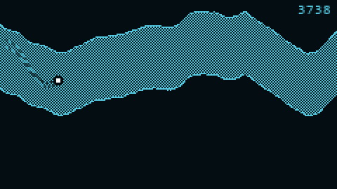
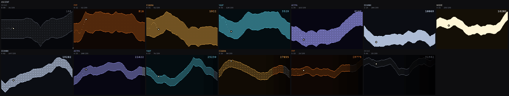
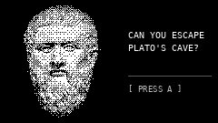
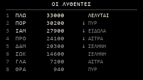
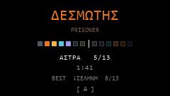
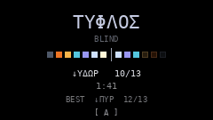
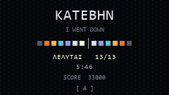

# Plato's Cave

A one-button cave-flyer for a pocket ESP32 handheld. You are a point of light
ascending out of Plato's cave; gravity pulls you down, the button thrusts you
up, rock kills you, distance is score.

The allegory isn't decoration. Plato's ascent in *Republic* 514a–517a is an
ordered sequence of light sources — shadows, fire, carried images, reflections in
water, stars, moon, sun — and that sequence supplies the game's entire
progression structure *and* its palette. **The screen brightens as you climb.**
Your progress isn't a number in the corner; it's how much you can see.

And reaching the sun isn't the end. Plato's freed prisoner is obliged to go back
down, and his eyes no longer work in the dark. **You win by returning to the
chains** — through the same seven regions, each dimmer than it was on the way up,
with the view closing in. Roughly 5½ minutes of unbroken flight.

One more borrowing, from the *Phaedrus* rather than the *Republic*: thrust
against gravity, with you holding the balance, is already the charioteer and his
two horses. So the trail runs as two strands, whichever is being obeyed leading.



*Leaving the cave: ΕΙΔΩΛΑ into ΥΔΩΡ, the largest colour jump in the run. Real
time, at the panel's true 240 × 135 shown at 2×.*

---



*All thirteen regions: the ascent along the top, the return below it. Every one
dimmer coming down than it was going up.*

---

## Screens

| | |
| --- | --- |
|  |  |
|  |  |
|  | |

All at true 240 × 135, the panel's real resolution.

**ΚΑΤΕΒΗΝ** — *I went down* — is the first word of the *Republic*, and after the
return it is exactly what you have just done. Death has two words: **ΔΕΣΜΩΤΗΣ**,
*prisoner*, climbing; **ΤΥΦΛΟΣ**, *blind*, returning, because 516e says the
returning man's eyes are full of darkness. The pip row under each shows how far
you got, coloured by each region's own light, with a divider where the sun is.

The high-score table is headed **ΟΙ ΛΥΘΕΝΤΕΣ** — *those who were released* — and
seeded so the ordering carries a joke: the Neoplatonists above the *Republic*'s
cast, because the cast were never released. They only heard it described.

See also [the seven ascent regions in detail](docs/images/stages_reference.png)
and [the difficulty levers across a full run](docs/images/descent_curves.png).

## Play it

`web/index.html` is a self-contained playable build — the same game, running the
same constants, so tuning done there transfers to the firmware.

It exists for one reason: **the three physics constants and `VIEW_CLOSE` have
never met a thumb**, and they are the design decisions most likely to be wrong.
The page shows those four values under the canvas, so "it feels floaty" arrives
attached to the number that causes it.

```bash
python tools/bake_web.py     # re-export cave.py's constants into the page
node tools/test_web.js       # check the web build against the Python model
```

`test_web.js` runs the game headlessly and compares all thirteen region timings
against `cave.py`, at 30 / 50 / 72 / 144 fps. Generated constants keep the
numbers in step; this checks the behaviour is too.

**Pin the terrain when comparing tunings.** Append `#seed=42` (or `?seed=42`)
and every run replays the same cave. Without it, "that felt better" may only
mean the generator dealt an easier tunnel. The seed of the current run is always
shown under the canvas and is a link that pins it, so a run worth repeating can
be repeated.

The tunnel is procedurally generated per run, but only the *route* is random —
the gap is a pure function of distance, identical every time, so the difficulty
curve never varies and scores stay comparable. The noise is applied to the
passage's rate of change rather than its position, damped and clamped, which is
why it undulates rather than jitters.

It also reports a difficulty reading. A lookahead autopilot — a rough proxy for
a good human — averages **81% of the distance and completes 0 of 5 runs**, dying
in the return with the view closing. Read that as a hint that `VIEW_CLOSE` may
be past fair, not as proof: an autopilot is not a player.

## Status

**Nothing has been built.** No firmware is written and the hardware has not been
bought. Everything so far is prototyped in Python at exact panel resolution, so
the visuals are settled and the feel is entirely unknown.

| | |
| --- | --- |
| Target | M5Stack **M5StickS3**, 240 × 135 landscape — *not yet purchased* |
| Visuals | prototyped and rendered at true panel resolution |
| Ascent and return | modelled end to end, 5 min 46 s |
| Pacing | frame-rate independent, verified 30–144 fps |
| Assets | baked to C headers, round-trip verified |
| Physics feel | **never tested** — three constants awaiting a thumb |
| Firmware | not started |

Two things gate the firmware and both need the board in hand: **how many
programmable buttons the StickS3 actually has**, and the three physics constants.

---

## Documentation

| Doc | Contents |
| --- | --- |
| [docs/HARDWARE.md](docs/HARDWARE.md) | What to buy and why. Confirmed specs, unverified items, and a record of the four devices considered and rejected. |
| [docs/GAME_DESIGN.md](docs/GAME_DESIGN.md) | Rules, the thirteen regions, the return, palette, pacing curve, open decisions. |
| [docs/ARCHITECTURE.md](docs/ARCHITECTURE.md) | Launcher-plus-modules structure, the input abstraction, build order. |
| [docs/ARCHIVE_POINTCLOUD.md](docs/ARCHIVE_POINTCLOUD.md) | The abandoned first direction, kept for its findings. |

**Read HARDWARE.md first if you're picking this up cold** — one open question
there (how many programmable buttons the StickS3 actually has) cascades into the
input design and the high-score entry screen.

---

## Tools

**The bakers feed the firmware. Everything else is design work.**

| | |
| --- | --- |
| `tools/cave.py` | The game. Simulates a run and renders it. **The reference implementation**: the C++ must match its math. |
| `tools/bake_assets.py` | Images and Greek text → 1-bit C headers. |
| `tools/bake_constants.py` | `cave.py` → `constants.h`. Also reports any constant that never reached the firmware. |
| `tools/verify_bake.py` | Parses the generated C back out and checks it. There is no compiler here, so nothing else would catch malformed output. |
| `tools/mockups.py` | The non-gameplay screens — title, high scores, both deaths, victory — at true 240 × 135. |
| `tools/readme_gif.py` | The gameplay loop above. Sized against a byte budget, since it is committed. |
| `tools/bake_web.py` | `cave.py` → the constants block in `web/index.html`. |
| `tools/test_web.js` | Runs the web build headlessly and checks it against the Python model. |
| `tools/stage_sheet.py` | Reference sheet of the seven ascent regions with palettes, hex values and per-stage difficulty numbers. |
| `tools/model_descent.py` | The full run including the return: difficulty curves across all three levers, and every region ascending and returning. |
| `tools/imgutil.py` | Palette-PNG saving for the committed reference images. |
| `tools/image_treatments.py` | Twelve treatments of a source image. Also supplies `prepare()`, which the bakers depend on. |
| `tools/isolate_head.py` | Cuts a subject off a photographed background onto black. Works when the subject is clearly brighter than the background; not when their tonal ranges overlap. |
| `tools/preview.py` · `sample_points.py` · `make_test_mesh.py` | The archived point-cloud direction. |

### Running it

```bash
python tools/cave.py --seconds 225 --fps 24 --scale 2
```

Simulates a full ascent, writes a gameplay GIF and a per-region contact sheet to
`preview/`, and prints the stage timings.

```bash
python tools/bake_assets.py && python tools/bake_constants.py && python tools/verify_bake.py
```

Regenerates everything under `firmware/plato/assets/` and checks it round-trips.
Deterministic — re-running produces byte-identical headers.

```bash
python tools/model_descent.py
python tools/mockups.py
python tools/stage_sheet.py
```

Regenerate the committed reference images in `docs/images/`.

Requires `numpy` and `pillow`. The archived point-cloud tools additionally need
`trimesh`, `scipy` and `networkx`. Rendering `image/plato.png` is not in the
repository; the baked assets derived from it are.

---

## How this got here

Worth recording, because the path explains the leftovers.

It began as a **rotating 3D Plato bust** for a LILYGO T-QT Pro, drawn as a point
cloud because marble shading collapses at 128 × 128. That worked — see
[the archive](docs/ARCHIVE_POINTCLOUD.md) — and produced some genuinely useful
findings about blue-noise sampling and dot coverage.

It then became a **Metal Gear codec display**, which was fun and is where the
Greek UI came from, before the rotating head was dropped in favour of treating a
still photograph.

It is now a **game**, which is the first version that gives the device a reason
to be picked up rather than glanced at. It was endless until the *Republic*
pointed out that the ascent has an ending and the descent is the hard part, at
which point it became winnable.

The target board changed too, once it emerged that the T-QT Pro has no battery
socket, a case that physically cannot contain a battery, and no speaker.

---

## Credits

- **3D scan** (`mesh/plato.glb`), used by the archived point-cloud tools:
  *Plato*, Fitzwilliam Museum, object GR.23.1850, via
  [Sketchfab](https://sketchfab.com/3d-models/plato-1df8376b55e347fb9bb4cf49375d6e5a),
  CC BY 4.0.
- **The sculpture** throughout is the Vatican Museums' herm of Plato, Museo
  Pio-Clementino, Sala delle Muse, Inv. 305 — a Roman copy after a Greek
  original of the late 4th century BC. Its base is inscribed ΖΗΝΩΝ.

---

## Repository

<https://github.com/Alienchisel/platos-cave> — private.

`image/`, `mesh/` and `preview/` are excluded: ~26 MB of source images and
regenerable output, against ~450 KB of actual source.

`firmware/plato_tqt/` keeps its name because it holds the archived T-QT sketch,
named for the board it targeted. It was never compiled.
